# 🚀 Telegram Emoji Collection & Dataset 🎨

> **The ultimate Telegram Emoji PNG asset dataset scraped directly from Emojipedia.**  
> Contains **1,898+ Telegram / Apple styled emoji PNG assets** neatly categorized with Unicode metadata and JSON index! ✨🎉

---

## 📁 Repository Directory Structure

```text
telegram-emojipedia-collection/
├── 📄 README.md                      # 📖 Comprehensive documentation (You are here!)
├── 📊 telegram-emojis.json           # 🗂️ Complete JSON metadata dataset index
└── 📂 assets/                        # 🖼️ Full high-resolution PNG emoji assets
    ├── 📂 smileys-emotion/          # 😀 Smileys, faces & emotional expressions
    ├── 📂 people-body/               # 👨‍👩‍👧‍👦 People, body parts & gestures
    ├── 📂 animals-nature/            # 🐶 Animals, plants & nature elements
    ├── 📂 food-drink/                # 🍕 Food, drinks & culinary items
    ├── 📂 travel-places/             # 🚗 Vehicles, buildings & maps
    ├── 📂 activities/                # ⚽ Sports, games & hobbies
    ├── 📂 objects/                   # 💡 Electronics, tools & household items
    ├── 📂 symbols/                   # 🔣 Signs, arrows & math symbols
    └── 📂 flags/                     # 🏴‍☠️ World flags & regional emblems
```

---

## ⚡ Categories Overview & Samples

### 😀 Smileys & Emotion (168 emojis)

 `😀` |  `😃` |  `😄` |  `😁` |  `😆` |  `😅`

### 👋 People & Body (385 emojis)

 `👋` |  `🤚` |  `🖐️` |  `✋` |  `🖖` | 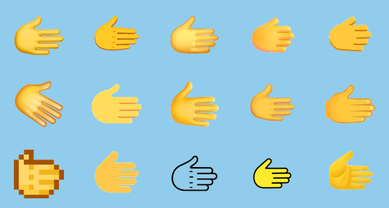 `🫱`

### 🐵 Animals & Nature (153 emojis)

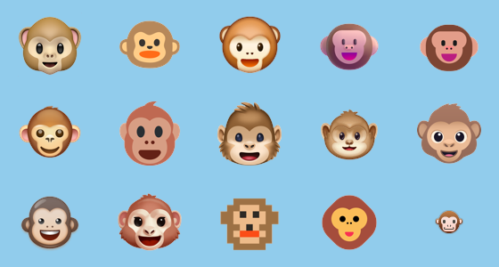 `🐵` | 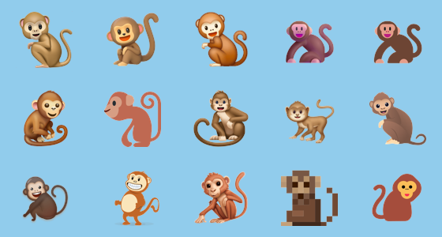 `🐒` | 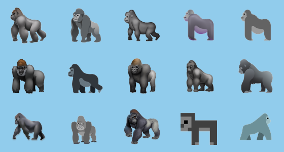 `🦍` | 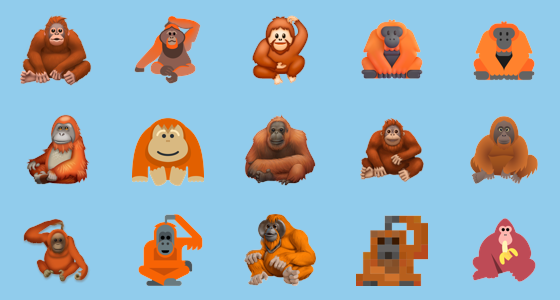 `🦧` | 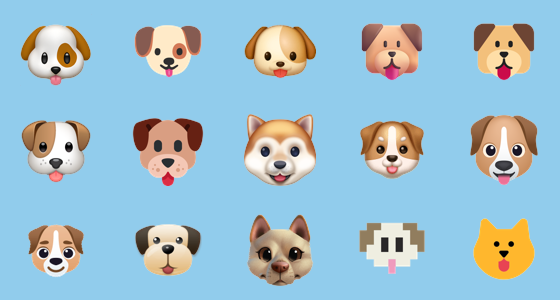 `🐶` | 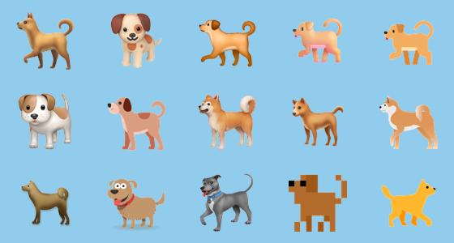 `🐕`

### 🍇 Food & Drink (135 emojis)

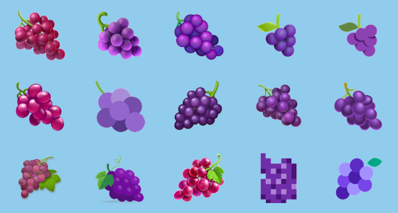 `🍇` | 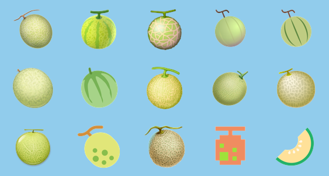 `🍈` |  `🍉` | 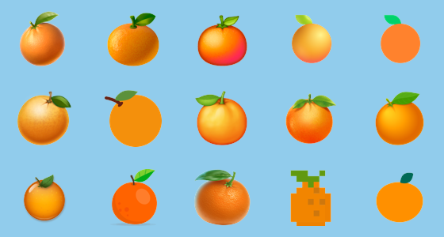 `🍊` | 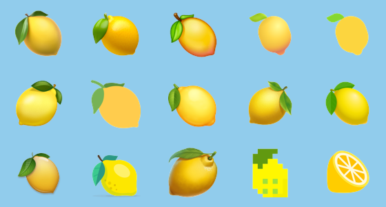 `🍋` |  `🍋‍🟩`

### 🌍 Travel & Places (218 emojis)

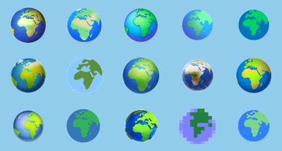 `🌍` | 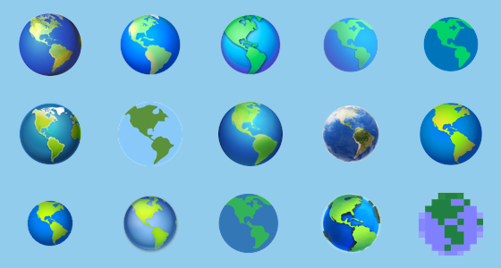 `🌎` | 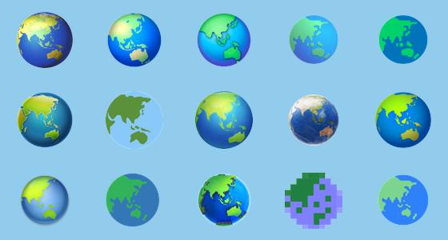 `🌏` |  `🌐` | 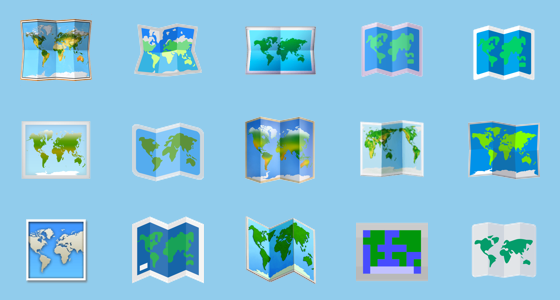 `🗺️` | 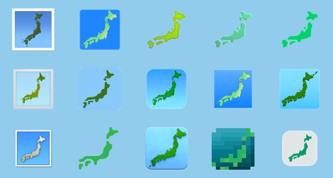 `🗾`

### 🎃 Activities (85 emojis)

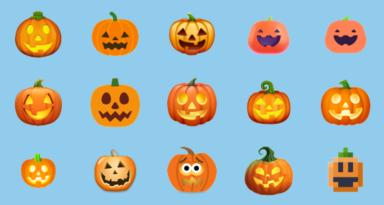 `🎃` | 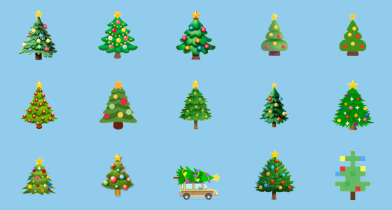 `🎄` | 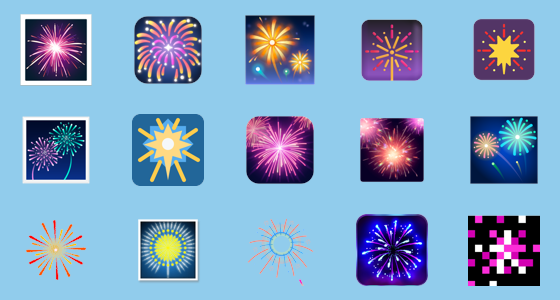 `🎆` | 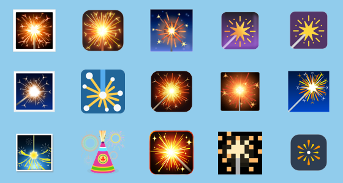 `🎇` |  `🧨` |  `✨`

### 👓 Objects (262 emojis)

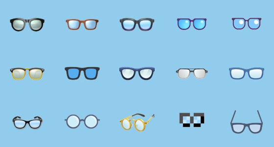 `👓` | 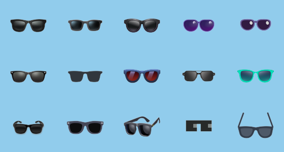 `🕶️` | 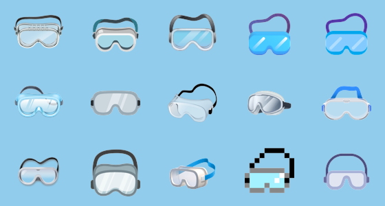 `🥽` |  `🥼` | 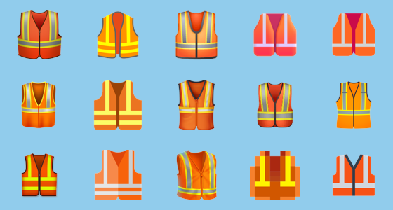 `🦺` |  `👔`

### 🏧 Symbols (223 emojis)

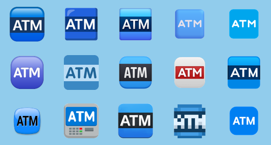 `🏧` | 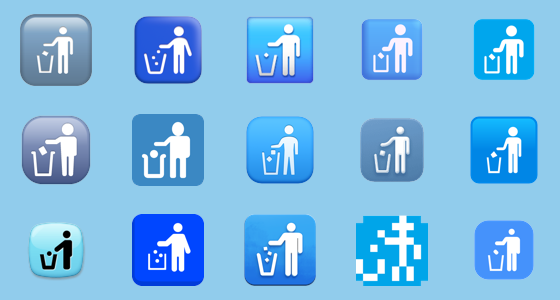 `🚮` |  `🚰` |  `♿` |  `🚻` |  `🚼`

### 🏁 Flags (269 emojis)

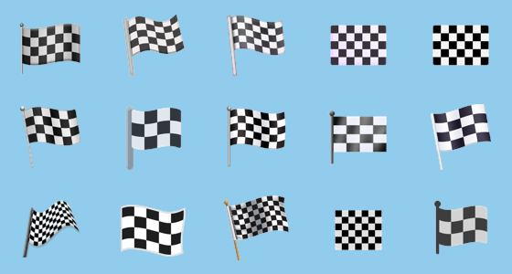 `🏁` | 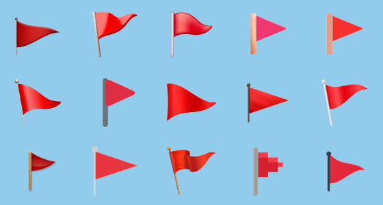 `🚩` | 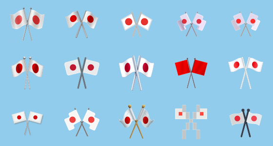 `🎌` | 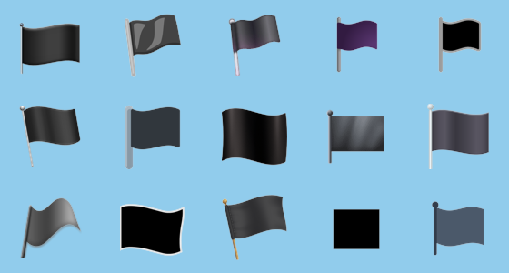 `🏴` | 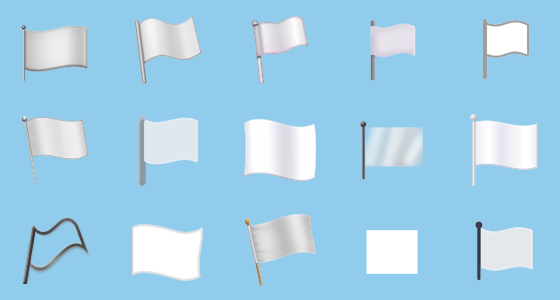 `🏳️` | 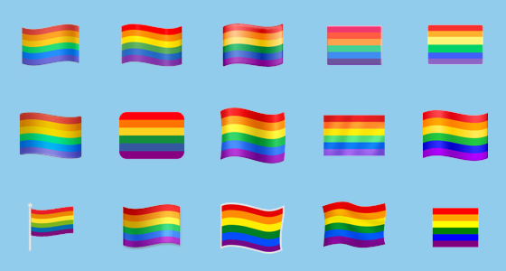 `🏳️‍🌈`

---

## 📄 JSON Dataset Structure (`telegram-emojis.json`)

```json
{
  "title": "Telegram Emoji Collection (Emojipedia Dataset)",
  "total_emojis": 1898,
  "emojis": [
    {
      "emoji": "😀",
      "name": "grinning face",
      "slug": "grinning-face",
      "category": "Smileys & Emotion",
      "emojipedia_url": "https://emojipedia.org/grinning-face",
      "telegram_apple_image": "https://em-content.zobj.net/social/emoji/grinning-face.png",
      "unicode_version": "1.0"
    }
  ]
}
```

---

## 🛠️ Usage & Integration

### Python Example
```python
import json

with open('telegram-emojis.json', 'r', encoding='utf-8') as f:
    dataset = json.load(f)

print(f"Total Emojis: {dataset['total_emojis']}")
for emoji_info in dataset['emojis'][:5]:
    print(f"{emoji_info['emoji']} - {emoji_info['name']} -> assets/{emoji_info['category'].lower().replace(' & ', '-').replace(' ', '-')}/{emoji_info['slug']}.png")
```

---

## 📜 License & Credits

- **Data Source:** [Emojipedia - Telegram Section](https://emojipedia.org/telegram) 🌐
- **Emoji Artwork:** Apple / Telegram 🍎/✈️
- **Dataset Maintainer:** [Z-150](https://github.com/Z-150) ⚡

*Maintained with ❤️ by Z-150.*
